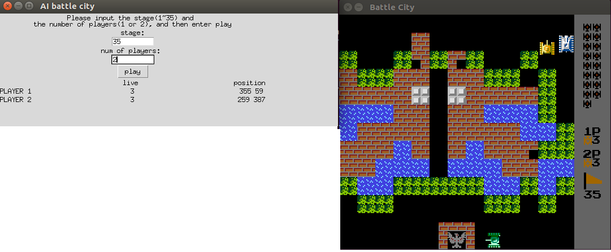
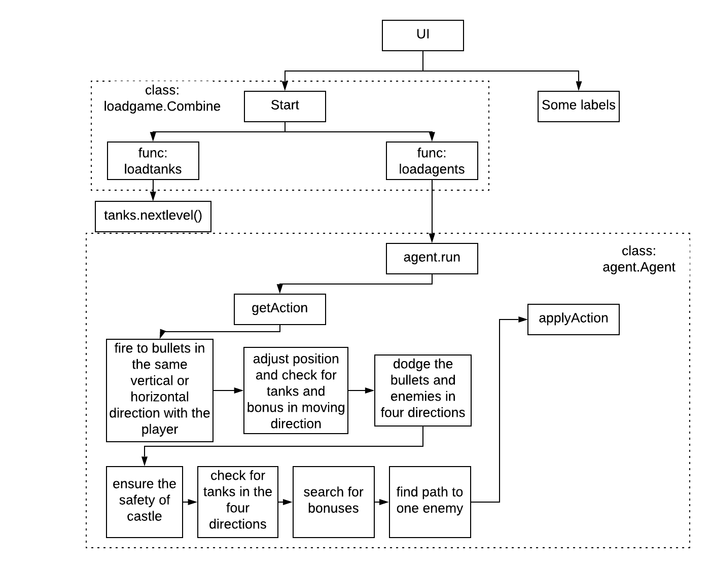

# battle-city auto test

forked from
* [softpedia.com](http://linux.softpedia.com/get/GAMES-ENTERTAINMENT/Arcade/BattleCity-Tanks-59571.shtml)
* [code.google.com](https://code.google.com/archive/p/battle-city-tanks/)

This is the auto test script in playing with battle-city. The original game script is forked from https://github.com/galaamn/battle-city.git. For the convenience of editing in original game script--tanks.py, my test script didn't change this file by using threading.
## Keys and arguments

### Controls in original game
- Player 1: * movement: up/left/down/right * fire: space
- Player 2: * movement: w/d/s/a * fire: f

- Press "-f" to start the game in fullscreen mode
- Press the "q" key will quit the game

### Explaination on files

In ui.py, some labels and buttons about ui are written, start() function in loadgame.Combine class is triggered by "play" button.

In loadgame.py, Combine class is created, including loadtanks(), loadagent(), getData() and start() functions. loadtanks() is used to load nextlevel() function in tanks.py; loadagent() is used to load run() function in agent.py; start() is used to run loadtanks() and ag.run() simultaneously by threading.

In agent.py, Agent class is created, including encodeMap(), dodge_bullets_enemies(), check_bullets(), check_tanks(), check_bonus(), getAction(), pathToDestination(), euclidean_distance(), isDestination(), reconstructPath(), neighbour(), run(), applyAction(), UpdateStrategy() functions. To decrease the calculation pressure, encodeMap() function is designed to transform position from range of 0-416 to that of 0-13, denoting each object(32*32) by its topleft point. In pathToDestination() function, A-star function is used to find the shortest path between two points. The check sequence to choose the most appropriate action based on information received can be explained by algorithm chartflow. 

## Algorithm

<!-- .element height="50%" width="50%" -->

- One player mode:
The whole check process(as show in chartflow) in getAction is used.

- Two players mode:
One player takes action the same as the player in One Player Mode, the other player takes the resposbility to protect castle, which doesn't trace enemy except it is in its four directions.

In the whole process, when the auto player fails in one stage, it will continue runing this stage automatically until it wins; else, it will go to the next stage. When stage 35 completes, the process will terminate.

## System requirements
* Python 2.7
* pygame
* math
* heapq
* os
* logging
* threading
* time
* TKinter

## Launch
Type `python ui.py` from command line, in AI-battle-city ui, choose stage and number of players, and then enter play. It will show the player' s lives and positions dynamically. 

## Output
test.log records the whole movement information in this process.

## Future improvments
How to adjust the running frequences between two threads.
